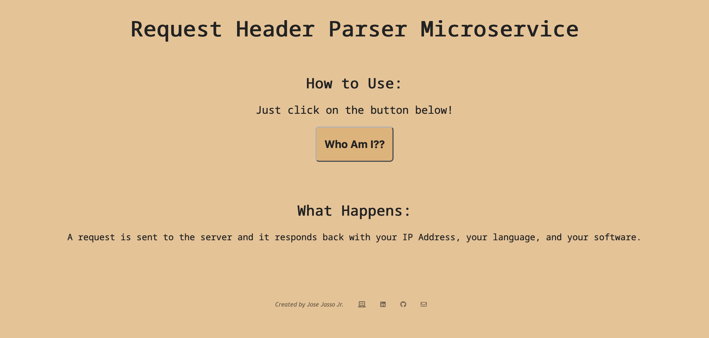

# Jose Jasso Jr. | Header Parser Microservice

A microservice designed to return information of an http request made by the server!

## Techs Used

[Node.js](https://nodejs.org/en/) and CSS

## Preview of Site

## Link to Site
Site can be found on [https://fcc-headerparser-jasso.herokuapp.com/](https://fcc-headerparser-jasso.herokuapp.com/) 

Deployed with [Heroku](https://heroku.com/)

